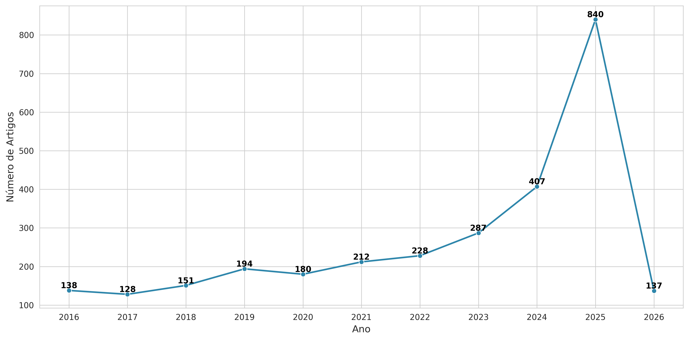
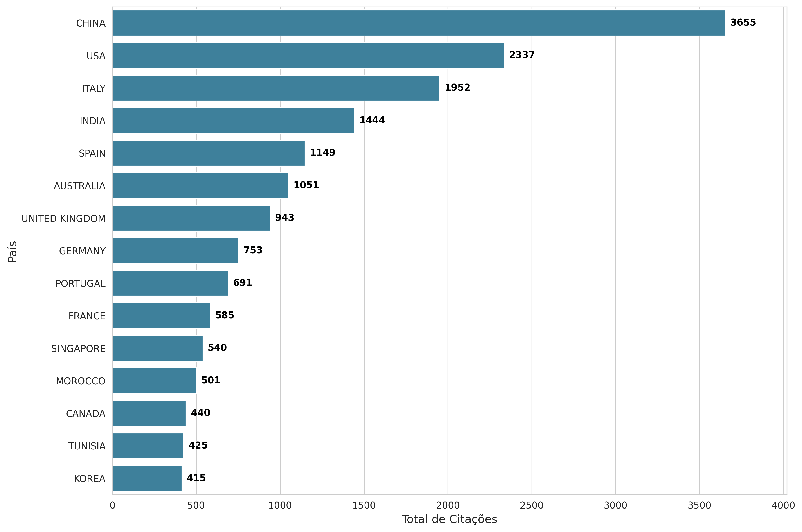
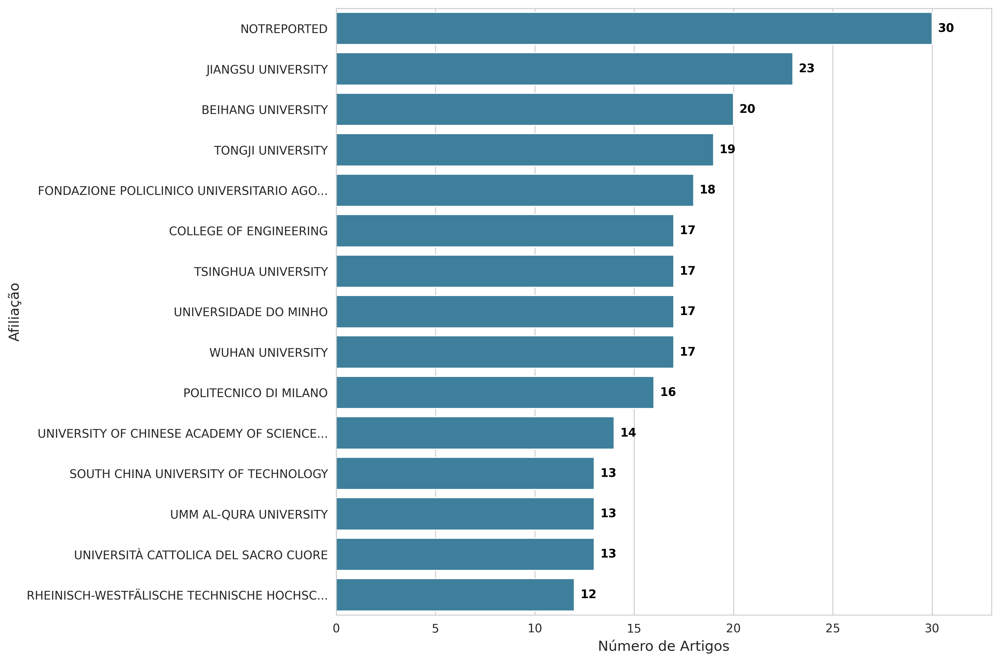
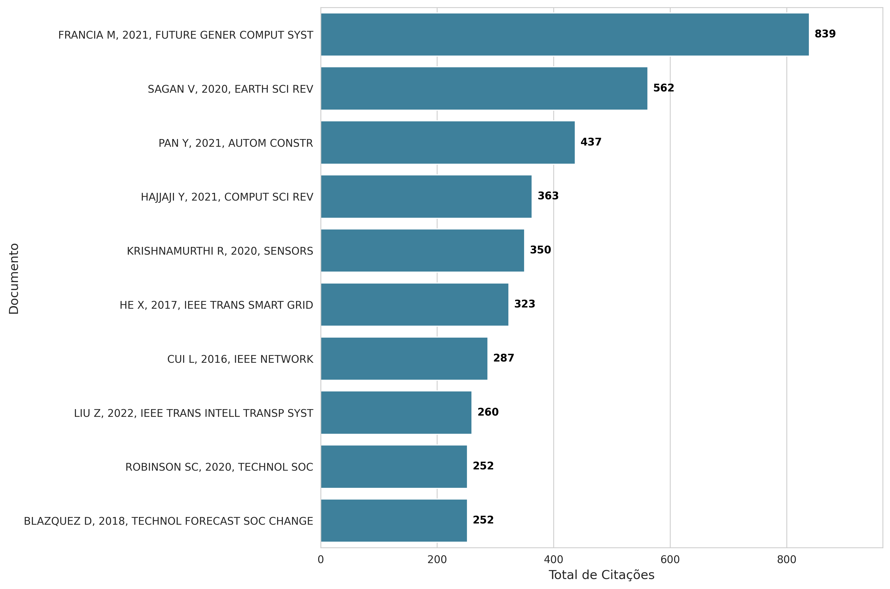
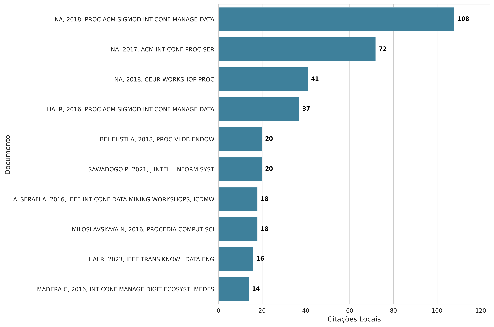
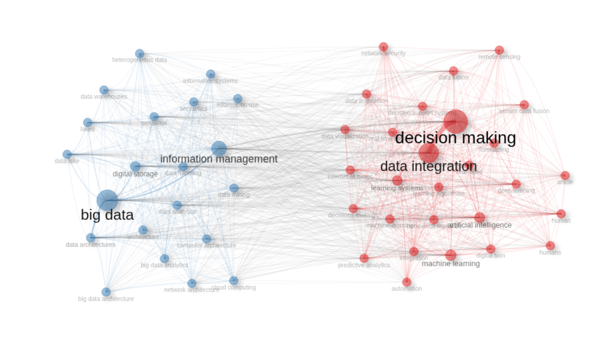

# **Análise Bibliométrica em Profundidade e Estruturação TEMAC - Base SCOPUS**

Este documento apresenta uma análise exaustiva dos resultados exportados via Bibliometrix (Scopus), com o objetivo de fornecer um alicerce robusto para a condução de uma Revisão Sistemática da Literatura (RSL). O relatório está dividido em duas partes: (I) Análise detalhada dos dados e (II) Síntese baseada na Metodologia TEMAC.

## **PARTE I: ANÁLISE DETALHADA DOS RESULTADOS BIBLIOMÉTRICOS**

### **1. Informações Principais e Crescimento da Produção Científica**

* **Visão Geral:** A amostra é composta por 2.902 documentos publicados entre 2016 e 2026, sendo **1.548 *Conference Papers*** e **1.033 *Articles***. Em áreas de rápida inovação tecnológica (como Ciência da Computação e Engenharia de Dados), as conferências parecem ser o principal veículo de disseminação, diferente de outras áreas que são ainda publicizadas primeiramente em periódicos tradicionais.  
* **Expansão da produção:** A produção saltou de 138 publicações (2016) para 840 (2025), como pode-se observar na Figura 1.

  <figure>
    
    <figcaption>Figura 1. Produção científica anual</figcaption>
  </figure>

* **Impacto das Citações:** Os anos de 2020 e 2021 apresentam as maiores médias de citações por ano (respectivamente 2,83 e 3,72 citações por artigo por ano). Artigos publicados neste período formam a base consolidada do conhecimento atual.

 

  <figure>
    
    <figcaption>Figura 2. Quantidade média de citações por ano</figcaption>
  </figure>

### **2 Análise de Fontes (Periódicos e Eventos)**

* **Lei de Bradford:** A lei de dispersão de Bradford indica que o "Núcleo 1" (Zone 1) do tema é composto por cerca de 63 fontes, ou seja, as primeiras 63 fontes (de um total de 1.553) representam o núcleo principal de pesquisas, com aproximadamente 959 documentos (primeiro terço da produção).  
* **Fontes Mais Relevantes e com Maior Impacto:** As séries *Lecture Notes in Computer Science* (103 artigos, h-index 14) e *Lecture Notes in Networks and Systems* (72 artigos) lideram em volume. No entanto, o **IEEE Access** (41 artigos, 767 citações, h-index 13) e o **Procedia Computer Science** (33 artigos, 818 citações) são as fontes de **maior impacto**. Notavelmente, periódicos como *Sensors* e *Sustainability* aparecem no topo, mostrando que o tema está transcendendo a computação pura e sendo aplicado em ecossistemas de IoT e Sustentabilidade.

### **3. Análise de Autores e Padrões de Colaboração**

* **Produtividade vs. Impacto:** Autores asiáticos dominam a produção (ZHANG Y, LI X, WANG Y). Contudo, o impacto local revela uma dinâmica interessante:  
  * **Liderança por TC (Total de Citações)**: O autor LI Y possui o maior impacto local (TC = 583), o que significa que ele é a maior referência teórica dentro desse grupo de documentos, seguido por COSTA C (TC = 424) e WANG H (TC = 399).  
  * **Eficiência (Impacto vs. Quantidade)**: LI X tem um impacto local razoável (TC = 343) com 35 publicações, enquanto ZHANG Y tem 44 publicações com impacto menor (TC = 190). Isso mostra que os trabalhos de LI X são, proporcionalmente, mais influentes.  
  * **O papel de ZHANG Y:** Apesar de um TC menor em comparação a LI Y, a análise da Rede de Colaboração (Figura 5) revela que ZHANG Y é o principal *hub* estrutural da pesquisa asiática. Ele atua como o "nó aglutinador" do maior *cluster* da rede (o cluster vermelho), conectando diversos pesquisadores e facilitando a alta produtividade do grupo.  
  * **Autores Âncora (QUIX C e HAI R):** Olhando estritamente para citações de documentos *dentro* da nossa amostra, **QUIX C (60 citações locais)** e **HAI R (59 citações locais)** destacam-se como os pilares teóricos. Suas pesquisas funcionam como a "cola" intelectual do campo; eles não apenas publicam, mas ditam a base teórica (focada em Data Lakes e integração semântica) que os outros autores asiáticos e europeus utilizam para desenvolver seus próprios trabalhos.

 

  <figure>
    
    <figcaption>Figura 3. Quantidade total de artigos produzidos por autor (2016-2026)</figcaption>
  </figure>

 

  <figure>
    
    <figcaption>Figura 4. Quantidade total de citações por autor (2016-2026)</figcaption>
  </figure>

De acordo com a *Openalex*, ZHANG Y publicou 234 trabalhos, tendo um total de 2037 citações, com os principais tópicos relacionados a *Data Management and Algorithms*, *Advanced Database Systems and Queries*, *Topic Modeling*, *Cloud Computing and Resource Management* e *Recommender Systems and Techniques*.

Por outro lado, ainda de acordo com a *Openalex*, QUIX C publicou 7 trabalhos, tendo um total de 393 citações, com os principais tópicos relacionados a *Data Lakes*, *Data Discovery*, *Semantic Web*, *Ontology-Based Data-Access*, *Metadata Management* e *Big Data*

* **Redes de Colaboração:** A rede de colaboração (Figura 5) é nitidamente dividida em quatro grandes comunidades de pesquisa (clusters vermelho, azul, verde e roxo). A dominância é do grupo vermelho (liderado por ZHANG Y e LI X). Observa-se que a pesquisa não ocorre em silos isolados; há pontes (arestas cinzas) cruzando os clusters, o que denota um campo acadêmico articulado, ainda que polarizado em torno de grandes grupos de pesquisa orientais.

 

  <figure>
    
    <figcaption>Figura 5. Rede de colaboração entre autores (2016-2026)</figcaption>
  </figure>

### **4. Distribuição Geográfica e Institucional**

* **Dominância Asiática:** A **China** é o motor do tema (1.521 publicações), seguida pela Índia (896) e EUA (692). Na Europa, Itália (332) e Alemanha (282) lideram. Contudo, apesar de produzir menos em volume que a Índia, os Estados Unidos possuem um impacto de citação significativamente maior, sugerindo trabalhos de caráter mais seminal ou publicações em revistas de maior estrato, conforme figuras 6 e 7.
  

  <figure>
    
    <figcaption>Figura 6. Quantidade de trabalhos publicados por país</figcaption>
  </figure>

  <figure>
    
    <figcaption>Figura 7. Quantidade de citações por país</figcaption>
  </figure>

* **Instituições e Casos de Uso:** As três instituições mais produtivas são chinesas: Jiangsu University (23), Beihang University (20) e Tongji University (19), conforme figura 8. Além disso, nota-se:  
  * **Área Médica/Saúde**: A presença da *Fondazione Policlinico Gemelli* (18) sugere que os Data Lakes e a IA estão sendo aplicados empiricamente na saúde.  
  * **Engenharia**: Universidades como Tsinghua (17) e Politecnico di Milano (16) reforçam um viés tecnológico aplicado.

  <figure>
    
    <figcaption>Figura 8. Quantidade de publicações por instituição</figcaption>
  </figure>

### **5. Fundações Teóricas e Espectroscopia Histórica**

* **Documentos Globais vs. Locais:** O artigo mais citado globalmente é *Francia M, 2021* (839 citações). Contudo, a verdadeira matriz do tema é revelada pelas citações locais. O documento **NA, 2018 (Proc ACM SIGMOD)** atua como o divisor de águas da área (108 citações locais), conforme figuras 9 e 10. Cabe destacar que o documento **NA, 2018** trata-se de um  **Proceedings** contendo diversos trabalhos na área e, por conta disso, pode ter tido muitas citações relacionadas a diversos autores que colaboraram com esse documento.

  <figure>
    
    <figcaption>Figura 9. Quantidade de citações globais por publicação</figcaption>
  </figure>

  <figure>
    
    <figcaption>Figura 10. Quantidade de citações locais por publicação</figcaption>
  </figure>

* **Historiografia e Fluxo do Conhecimento:** A análise historiográfica e a rede de cocitação revelam a linha do tempo exata da evolução técnica da área:  
  * **A Gênese (2015-2016):** A rede de cocitação mostra que o campo se apoia fortemente em trabalhos fundamentais como *"Managing data lakes in big data era"* (Fang, 2015) e *"An intelligent data lake system"* (Hai R., 2016), conforme figuras 11 e 12.
  
      

        <figure>
          
          <figcaption>Figura 11. Quantidade de citações locais por publicação</figcaption>
        </figure>
      

  * **O Pivô (2018):** O documento *NA, 2018*, relacionado ao trabalhos publicados no *PROCEEDINGS OF THE ACM SIGMOD INTERNATIONAL CONFERENCE ON MANAGEMENT OF DATA* serve como um funil no grafo histórico, reunindo o conhecimento disperso dos anos anteriores e padronizando-o.  
  * **A Maturidade (2021-2023):** A partir dessa consolidação, o fluxo histórico aponta para as pesquisas mais contemporâneas de consolidação (como Sawadogo P., 2021 e trabalhos subsequentes de Hai R., 2023), focados em otimização de consultas e aplicação.

    

      <figure>
        
        <figcaption>Figura 12. Rede cronológica de citações diretas dos artigos mais relevantes sobre o assunto </figcaption>
      </figure>
    

### **6. Temática, Evolução de Palavras-chave e Tendências (Lakehouse)**

* **A Dicotomia Conceitual:** A análise de co-ocorrência de palavras revela uma divisão quase perfeita da área em dois grandes hemisférios interligados, como pode-se observar na figura 13:  
  * **Hemisfério Azul (Infraestrutura):** Agrupa os conceitos base como "Big Data", "Data Warehouses", "Information Management" e "Cloud Computing". É a camada fundacional.  
  * **Hemisfério Vermelho (Valor e Aplicação):** Agrupa os conceitos voltados ao uso da informação, como "Artificial Intelligence", "Machine Learning" e, como centro gravitacional, **"Decision Making"** (termo mais frequente de toda a amostra, superando o próprio Big Data). O campo foca em *como* extrair valor (Vermelho) da infraestrutura (Azul).

  

    <figure>
      
      <figcaption>Figura 13. Rede de Co-ocorrência de Palavras-chave</figcaption>
    </figure>
  

* **Acoplamento Bibliográfico e o Surgimento do Lakehouse:** O Mapa de Acoplamento revela o que está gerando mais impacto *atualmente*. Enquanto os clusters focados puramente em "Big Data" ou "Data Lake" têm alto impacto estrutural, desponta no quadrante de alta centralidade e alto impacto o cluster **"Data Lakehouse - conf 71.4%"**. Isso indica uma clara tendência de ruptura tecnológica: a pesquisa de vanguarda está abandonando a dualidade Warehouse/Lake e focando na arquitetura unificada de *Lakehouse*.

  

    <figure>
      
      <figcaption>Figura 14. Mapa Temático de Acoplamento Bibliográfico: Análise de Centralidade e Impacto </figcaption>
    </figure>
  

* **Mapa Temático Estratégico: Temas Básicos:** Big Data e Information Management. (Já consolidados, viraram pré-requisitos), conforme figura 15 abaixo.  
  * **Temas Motores:** Decision Making e Machine Learning. (Alta centralidade e densidade, são o coração da inovação atual).  
  * **Temas Emergentes:** Data Integration, Internet of Things e Digital Twin. (As próximas fronteiras empíricas).

  

    <figure>
      
      <figcaption>Figura 15. Matriz de Evolução Temática: Maturidade e Interconexão dos Clusters de Pesquisa  </figcaption>
    </figure>
  

## **PARTE II: SÍNTESE METODOLÓGICA T-E-M-A-C**

Com base na interpretação aprofundada acima, estruturamos os pilares para a escrita da Revisão Sistemática da Literatura.

### **T - Teoria (A base conceptual)**

A literatura sofreu uma mutação teórica evidente. A teoria de base evoluiu do mero "processamento distribuído em lote" para o conceito de **Arquiteturas de Gestão Dinâmica**.

* **Fundamento Central:** A transição do conceito de *Data Warehouse* (dados estruturados) para *Data Lakes* (dados brutos e heterogêneos), formalizada por autores mapeados na rede de cocitação, como Fang (2015) e Hai (2016).  
* **Evolução Teórica Atual:** O estado da arte teórico, evidenciado no Mapa de Acoplamento, postula a transição para arquiteturas híbridas unificadas (**Data Lakehouses**), que combinam a flexibilidade do Lake com a governança do Warehouse, além da integração com a computação em nuvem/névoa para lidar com a Internet das Coisas.

### **E - Empiria (O campo de observação e prática)**

A empiria desta área do conhecimento é caracterizada por testes massivos em escala, liderados pelo eixo Asiático (China e Índia).

* **Domínios de Aplicação:** Os dados confirmam que a experimentação saiu dos laboratórios. A presença forte de publicações na área médica (Hospital Policlinico Gemelli), em revistas de *Sustainability* e *Automation in Construction*, mostra que as arquiteturas estão sendo testadas empiricamente na **Saúde Inteligente**, **Cidades Inteligentes** e **Construção Civil (Digital Twins)**.  
* **Lacunas Empíricas (Research Gaps):** Existe uma vasta lacuna empírica na aplicação dessas tecnologias em cenários de infraestrutura precária ou ambientes de baixo orçamento, típicos do Sul Global (América Latina e África), visto que a produção nestas regiões é marginal.

### **M - Metodologia (Ferramentas e técnicas de resolução)**

Para resolver os desafios da arquitetura de dados modernos, a literatura abandonou métodos puramente estatísticos e abraçou a computação avançada.

* **Inteligência Habilitadora:** Como visto no Mapa Temático (Temas Motores), o uso de **Artificial Intelligence** e **Machine Learning** são as metodologias padrão (*gold standard*) atuais para promover a extração de valor do *Data Lake*.  
* **Maturidade Metodológica:** A metodologia vigente não procura apenas "entender o que aconteceu" com os dados (arquivamento), mas usar algoritmos para "prever o que vai acontecer" com altíssima velocidade em sistemas de tempo real (*predictive analytics*).

### **A - Análise (O foco do escrutínio dos pesquisadores)**

O que os investigadores estão realmente a analisar quando processam este volume de dados?

* **Tomada de Decisão:** Conforme a rede de palavras provou, o objetivo principal de todas as arquiteturas não é o armazenamento técnico, mas o **Decision Making**. A análise recai sobre como criar *Decision Support Systems* rápidos e confiáveis.  
* **Representação Virtual:** Uma forte tendência analítica (presente no quadrante de temas emergentes) é o **Digital Twin** (Gêmeo Digital). A análise da literatura foca em como utilizar a integração de dados para criar simulações contínuas de sistemas físicos.

### **C - Contexto (O ambiente circundante)**

O contexto tecnológico, social e de mercado que exige essas pesquisas.

* **Gatilho Contextual (IoT):** A *Internet of Things* (IoT) é o grande motor. O contexto atual é um mundo hiper-sensorizado gerando um tsunami de dados desestruturados, exigindo a substituição das antigas arquiteturas.  
* **Contexto de Maturidade:** O campo entrou em fase de refinamento. O desafio atual não é mais "construir o Data Lake", mas garantir a **governança de dados, a reprodutibilidade (Lakehouses) e a eficiência do Machine Learning integrado**.

### **💡 Recomendações Estratégicas Finais para a RSL**

1. **Foco Temporal:** Defina a janela da sua revisão sistemática para artigos publicados **após 2018**. Como a historiografia revelou, foi em 2018 que ocorreu o "pivô" centralizador de conhecimento. Textos muito anteriores discutirão conceitos que já não refletem a fronteira de inovação (Lakehouses e IA).  
2. **Busca em Conferências:** Não restrinja sua busca apenas a *journals*. O cerne inovador da área (mais de 50% dos documentos e os de maior impacto inicial) reside nos *Conference Papers*.  
3. **Foco Terminológico:** Garanta que sua *string* de busca para a revisão bibliográfica englobe os termos **"Data Lakehouse"** e **"Digital Twin"**, pois a análise provou que estas são as vertentes de maior impacto e tendências emergentes.  
4. **Sugestão de Pergunta de Pesquisa (RQ):** Baseado na metodologia TEMAC extraída, uma excelente pergunta para sua revisão seria: *"Como a transição para arquiteturas de Data Lakehouse (T) e a integração de Machine Learning (M) otimizam os Sistemas de Apoio à Tomada de Decisão (A) em contextos hiper-sensorizados (C/E)?"*