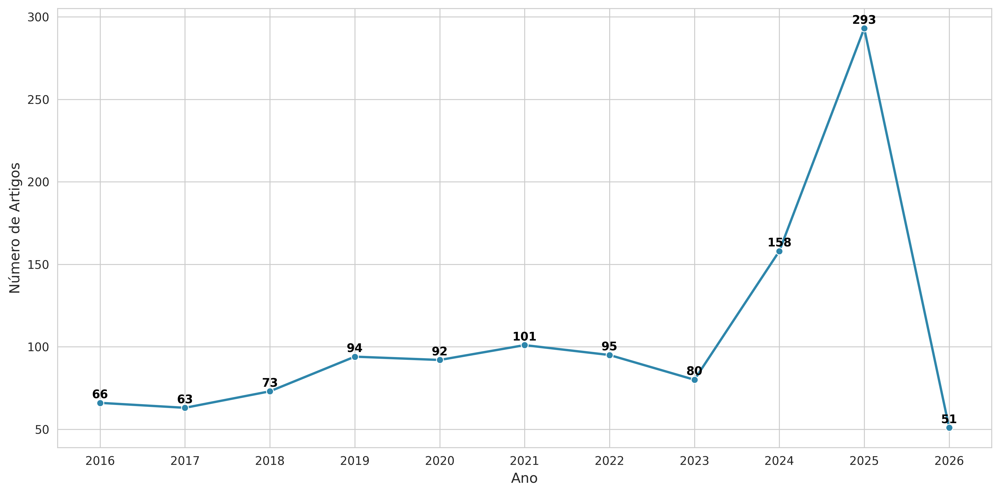
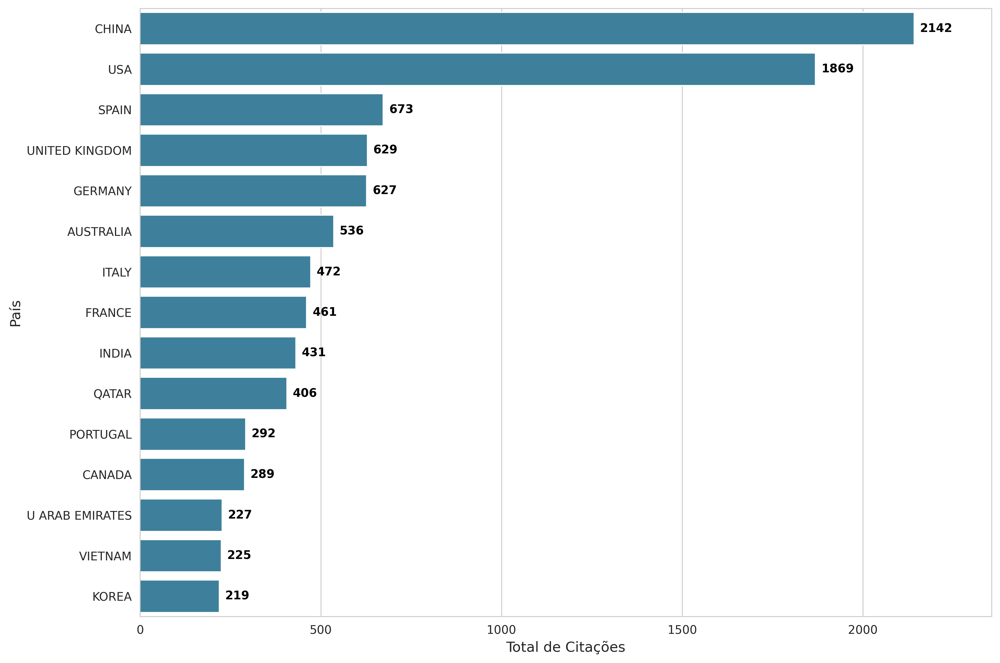
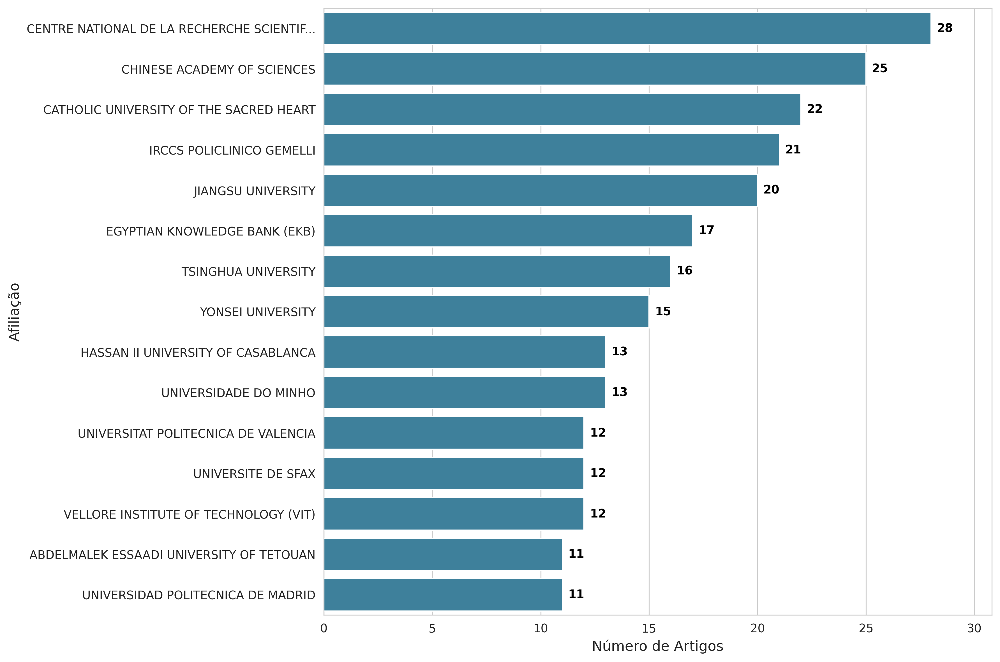
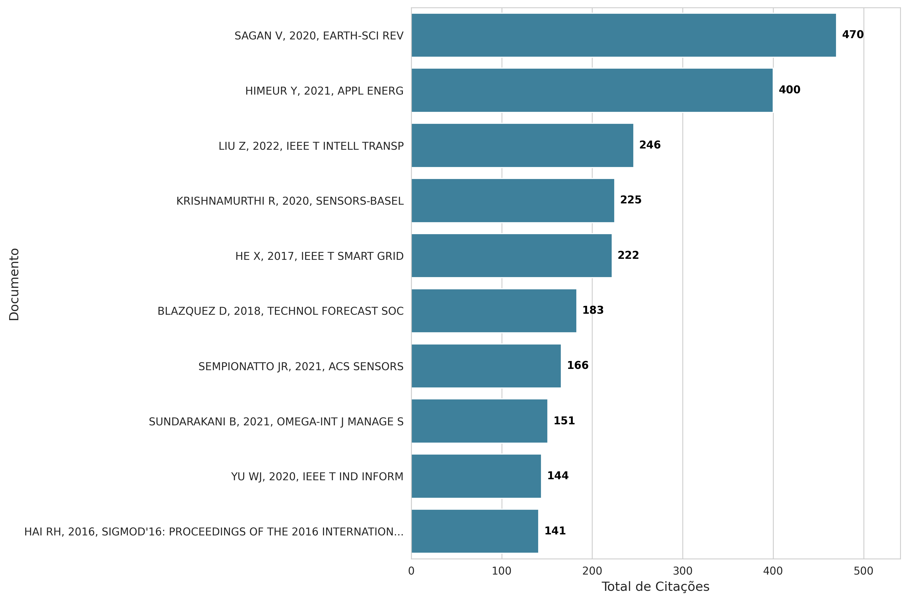
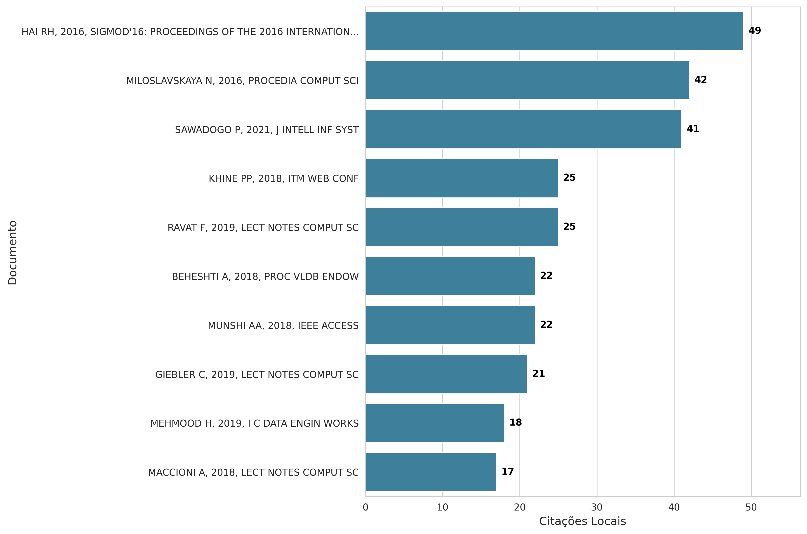
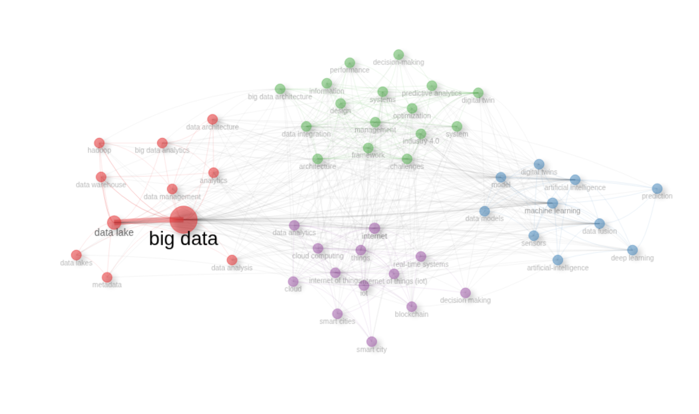

# **Estágio II - Análise Detalhada dos Resultados Biblitométricos (WoS)**

### **1. Informações Principais e Crescimento da Produção Científica**

* **Visão Geral:** A amostra é composta por **1.166 documentos** publicados entre 2016 e 2026, sendo **557 *Articles*** e **452 *Proceedings Papers*** (conferências). Observa-se que, diferente de outras áreas, a WoS apresenta uma proporção mais equilibrada entre artigos de periódico e artigos de conferência, embora os artigos (557) ainda superem os proceedings papers (452). Em áreas de rápida inovação tecnológica (como Ciência da Computação e Engenharia de Dados), as conferências são o principal veículo de disseminação, enquanto os periódicos tradicionais continuam sendo importantes para a consolidação técnica.
* **Expansão da produção:** A produção scientific começou com 66 publicações (2016) e cresceu significativamente para 293 (2025), com um pico ainda maior previsto para 2026, conforme pode-se observar na Figura 1.

  <figure>
    
    <figcaption>Figura 1. Produção científica anual</figcaption>
  </figure>

* **Impacto das Citações:** Os anos de 2021 e 2022 apresentam as maiores médias de citações por ano (respectivamente 2,96 e 2,94 citações por artigo por ano). Artigos publicados neste período formam a base consolidada do conhecimento atual.

  <figure>
    
    <figcaption>Figura 2. Quantidade média de citações por ano</figcaption>
  </figure>

### **2 Análise de Fontes (Periódicos e Eventos)**

* **Lei de Bradford:** A lei de dispersão de Bradford indica que o "Núcleo 1" (Zone 1) do tema é composto por cerca de 46 fontes, ou seja, as primeiras 46 fontes (de um total de 838) representam o núcleo principal de pesquisas, com aproximadamente 389 documentos (primeiro terço da produção).
* **Fontes Mais Relevantes e com Maior Impacto:** O **IEEE Access** (35 artigos) lidera em volume de publicações. No entanto, **Sensors** (21 artigos, h-index 9, 424 citações totais) é a fonte de **maior impacto**, seguido pelo **IEEE Access** (h-index 8, 308 citações) e **Journal of Building Engineering** (h-index 6, 356 citações). Notavelmente, periódicos como *Sustainability* e *Applied Sciences* aparecem no topo, mostrando que o tema está transcendendo a computação pura e sendo aplicado em ecossistemas de IoT e Sustentabilidade.

  <figure>
    
    <figcaption>Figura 3. Fontes mais relevantes por número de artigos</figcaption>
  </figure>

  <figure>
    
    <figcaption>Figura 4. Impacto das fontes (total de citações)</figcaption>
  </figure>

### **3. Análise de Autores e Padrões de Colaboração**

* **Produtividade vs. Impacto:** Autores asiáticos e europeus dominam a produção (ZHANG Y, SANTOS MY, DARMONT J, ZHAO Y). Contudo, o impacto local revela uma dinâmica interessante:
  * **Liderança por Citações Locais**: **QUIX C** possui o maior impacto local (63 citações locais), seguido por **HAI RH** (62) e **DARMONT J** (60). Estes autores são as maiores referências teóricas dentro desse grupo de documentos.
  * **Eficiência (Impacto vs. Quantidade)**: CHONG AYL tem impacto local de 321 citações com *h-index* igual a 4, enquanto ZHANG Y tem 10 publicações com impacto menor. Isso mostra que os trabalhos de CHONG AYL são, proporcionalmente, mais influentes.
  * **O papel de ZHANG Y:** Apesar de um TC menor em comparação a QUIX C e HAI RH, a análise da Rede de Colaboração (Figura 8) revela que ZHANG Y é o principal *hub* estrutural da pesquisa asiática, conectando diversos pesquisadores e facilitando a alta produtividade do grupo.
  * **Autores Âncora (QUIX C e HAI RH):** Olhando estritamente para citações de documentos *dentro* da nossa amostra, **QUIX C (63 citações locais)** e **HAI RH (62 citações locais)** destacam-se como os pilares teóricos. Suas pesquisas funcionam como a "cola" intelectual do campo; eles não apenas publicam, mas ditam a base teórica (focada em Data Lakes e integração semântica) que os outros autores asiáticos e europeus utilizam para desenvolver seus próprios trabalhos.

  <figure>
    
    <figcaption>Figura 5. Quantidade total de artigos produzidos por autor (2016-2026)</figcaption>
  </figure>

  <figure>
    
    <figcaption>Figura 6. Quantidade total de citações locais por autor (2016-2026)</figcaption>
  </figure>

  <figure>
    
    <figcaption>Figura 7. Impacto local dos autores (total de citações)</figcaption>
  </figure>

* **Redes de Colaboração:** A rede de colaboração (Figura 8) revela um campo de pesquisa fragmentado em silos isolados. Observa-se a formação de comunidades fechadas (clusters), com forte colaboração interna, mas ausência de pontes (arestas) cruzando os diferentes grupos. Isso denota um cenário acadêmico desarticulado globalmente em termos de coautoria, onde grandes grupos de pesquisa orientais (como o cluster de ZHANG Y) e europeus publicam e evoluem de forma paralela, sem evidências visuais de colaboração direta entre os diferentes grupos.

  <figure>
    
    <figcaption>Figura 8. Rede de colaboração entre autores (2016-2026)</figcaption>
  </figure>

### **4. Distribuição Geográfica e Institucional**

* **Dominância Asiática:** A China é o motor do tema em volume (636 publicações), seguida pelos EUA (299), Itália (175) e Índia (167). Na Europa, Itália (175), França (126), Alemanha (118), Espanha (109) e Reino Unido (109) lideram. Contudo, ao analisar a eficiência de impacto, nota-se uma dinâmica distinta: embora produzam menos da metade do volume chinês, os Estados Unidos possuem uma taxa de impacto proporcionalmente muito maior (média de ~6,25 citações por artigo contra ~3,37 da China). Isso sugere que os trabalhos estadunidenses possuem caráter mais seminal ou são veiculados em revistas de maior estrato de impacto, conforme evidenciado no cruzamento das Figuras 9 e 10.
  

  <figure>
    
    <figcaption>Figura 9. Quantidade de trabalhos publicados por país</figcaption>
  </figure>

  <figure>
    
    <figcaption>Figura 10. Quantidade de citações por país</figcaption>
  </figure>

* **Instituições e Casos de Uso:** As três instituições mais produtivas são: Centre National de la Recherche Scientifique (28), Chinese Academy of Sciences (25) e Catholic University of the Sacred Heart (22), conforme figura 11. Além disso, nota-se a presença da *IRCCS Policlinico Gemelli* (21) sugere que os Data Lakes e a IA estão sendo aplicados empiricamente na saúde.
  

  <figure>
    
    <figcaption>Figura 11. Quantidade de publicações por instituição</figcaption>
  </figure>

### **5. Fundações Teóricas e Espectroscopia Histórica**

* **Documentos Globais vs. Locais:** O artigo mais citado globalmente é *SAGAN V, 2020, EARTH-SCI REV* (470 citações). Contudo, a verdadeira matriz do tema é revelada pelas citações locais. O documento HAI RH, 2016, SIGMOD'16, *An Intelligent Data Lake System*, atua como o divisor de águas da área (49 citações locais), conforme figuras 12 e 13.

  <figure>
    
    <figcaption>Figura 12. Quantidade de citações globais por publicação</figcaption>
  </figure>

  <figure>
    
    <figcaption>Figura 13. Quantidade de citações locais por publicação</figcaption>
  </figure>

* **Historiografia e Fluxo do Conhecimento:** A análise historiográfica e a rede de cocitação revelam a linha do tempo exata da evolução técnica da área:  
  * **A Gênese (2015-2016):** A rede de cocitação mostra que o campo se apoia fortemente em trabalhos fundamentais como *"Managing data lakes in big data era"* (Fang, 2015, 48 citações locais) e *"An intelligent data lake system"* (Hai R., 2016, 49 citações locais), conforme figuras 14 e 15.
  
      

        <figure>
          
          <figcaption>Figura 14. Referências locais mais citadas</figcaption>
        </figure>
      

  * **O Pivô (2016-2018):** O documento *HAI RH, 2016, SIGMOD'16* relacionado ao *PROCEEDINGS OF THE ACM SIGMOD INTERNATIONAL CONFERENCE ON MANAGEMENT OF DATA* serve como um funil no grafo histórico, reunindo o conhecimento disperso dos anos anteriores e padronizando-o.
  * **A Maturidade (2021-2023):** A partir dessa consolidação, o fluxo histórico aponta para as pesquisas mais contemporâneas de consolidação (como Sawadogo P., 2021 e trabalhos subsequentes), focados em otimização de consultas e aplicação.

    

      <figure>
        
        <figcaption>Figura 15. Rede cronológica de citações diretas dos artigos mais relevantes sobre o assunto</figcaption>
      </figure>
    

### **6. Temática, Evolução de Palavras-chave e Tendências (Lakehouse)**

* **Estruturação Temática em Clusters:** A análise de co-ocorrência de palavras-chave revela que a área de pesquisa se organiza em quatro grandes clusters (agrupamentos) temáticos interdependentes, conforme pode-se observar na Figura 16. Esta topologia demonstra a real complexidade do ecossistema estudado:
  * **Cluster 1: Infraestrutura Fundacional de Dados:** Agrupa os conceitos estruturais de armazenamento, arquitetura e governança, englobando termos como Big Data, Data Lake, Data Warehouse, Hadoop, Data Architecture e Metadata. Representa a base tecnológica robusta necessária para a retenção, estruturação e gestão da informação em larga escala.
  * **Cluster 2: Inteligência Artificial e Modelagem Avançada:** Concentra as técnicas e algoritmos de extração de valor, incluindo Machine Learning, Artificial Intelligence, Deep Learning, Data Fusion e Sensors. É o motor analítico da pesquisa, focado em transformar os dados armazenados na infraestrutura em modelos preditivos e inteligência acionável.
  * **Cluster 3: Engenharia de Sistemas e Apoio à Decisão:** Focado na orquestração arquitetônica e na aplicação estratégica, reunindo termos como System, Framework, Data Integration, Optimization, Industry 4.0 e Decision-Making. Este agrupamento atua como a ponte de integração, focando em como desenhar sistemas eficientes para suportar processos decisórios complexos em domínios operacionais.
  * **Cluster 4: Ecossistemas Conectados e Computação Distribuída:** Engloba os ambientes de captura e as plataformas de execução, destacando Internet of Things (IoT), Cloud Computing, Real-Time Systems, Blockchain e Smart Cities. Define o cenário de captura moderno: as bordas de onde os dados fluem em tempo real e as nuvens onde os serviços são escalados.

  

    <figure>
      
      <figcaption>Figura 16. Rede de Co-ocorrência de Palavras-chave</figcaption>
    </figure>
  

* **Acoplamento Bibliográfico** O Mapa de Acoplamento (Figura 17) revela a estrutura de referências que sustenta a área atualmente. O cluster dominado por 'data lake' e 'big data' (no quadrante superior direito) demonstra altíssima centralidade e impacto. Isso indica que a literatura fundamentada no conceito de Data Lakes consolidou-se como o núcleo intelectual indiscutível da pesquisa, servindo como base matriz obrigatória para os novos desenvolvimentos tecnológicos e arquitetônicos do campo.

  

    <figure>
      
      <figcaption>Figura 17. Mapa Temático de Acoplamento Bibliográfico: Análise de Centralidade e Impacto</figcaption>
    </figure>
  

* **Mapa Temático Estratégico:** A análise da Figura 18 posiciona os agrupamentos temáticos em quatro quadrantes distintos, baseados em sua centralidade (relevância) e densidade (desenvolvimento), revelando o real estágio de maturidade de cada frente:
  * **Temas Motores (Alta centralidade e alta densidade):** O agrupamento focado em Digital Twin, Management e Data Integration. Representam o coração da inovação atual na área, sendo temas bem desenvolvidos e vitais para a estruturação do campo.
  * **Temas Básicos (Alta centralidade e baixa densidade):** O cluster de Machine Learning, Artificial Intelligence e Data Fusion. São temas transversais e consolidados, atuando como ferramentas de prateleira fundamentais para viabilizar as aplicações da área.
  * **Temas de Nicho (Baixa centralidade e alta densidade):** O grupo de Impact, Neural Network e Behavior, indicando frentes de pesquisa muito isoladas e específicas.
  * * **Temas Emergentes ou em Declínio (Baixa centralidade e baixa densidade):** É notável a presença da infraestrutura tradicional neste quadrante, incluindo os clusters de Internet of Things e, crucialmente, de Big Data e Data Lake. O posicionamento de Data Lake neste quadrante corrobora a tese de transição tecnológica: o conceito como "palavra-chave fim" pode estar em declínio ou fundindo-se a novas arquiteturas unificadas (Lakehouse), deixando de ser o foco primário de pesquisa isolada para se tornar uma base subjacente

  

    <figure>
      
      <figcaption>Figura 18. Matriz de Evolução Temática: Maturidade e Interconexão dos Clusters de Pesquisa</figcaption>
    </figure>
  

* **Tendências de Palavras-chave:** Observa-se uma clara evolução temporal:
  - **2016-2018**: Fast Data, Hadoop, MapReduce, Neural Networks (Infraestrutura técnica)
  - **2019-2021**: Big Data Analytics, Data Warehouse, Business Intelligence (Consolidação)
  - **2021-2023**: Data Lake, Data Integration, Digital Twin (Tendências atuais)

  <figure>
    
    <figcaption>Figura 19. Evolução temporal dos tópicos de tendência</figcaption>
  </figure>

# **Estágio 3 \- Detalhamento, Modelagem Integrativa e Validação por Evidências**

Para consolidar a Revisão Sistemática da Literatura e estruturar a fundamentação teórica, os seguintes passos metodológicos devem ser executados em sequência:

1. **Triagem e Seleção (Afunilamento):** Aplicação rigorosa dos critérios de inclusão e exclusão para reduzir a amostra inicial de 1.166 documentos a um portfólio de leitura viável e de alta relevância.  
2. **Análise de Conteúdo (Leitura Integral):** Extração sistemática de dados dos artigos finais selecionados. O foco recairá sobre as metodologias utilizadas, lacunas de investigação apontadas, construtos teóricos, arquiteturas propostas e resultados empíricos.  
3. **Síntese e Modelagem Integrativa:** Criação de um *framework* conceptual que consolide o estado da arte e direcione a agenda da investigação. Isto inclui mapear a transição das arquiteturas de *Data Lakes* para *Lakehouses*, especialmente no suporte à tomada de decisão operacional.

## **3.1. Diretrizes para Seleção da Amostra (Baseadas em Evidências Bibliométricas)**

A adoção do método TEMAC permite que a escolha da amostra de leitura (Estágio 3\) seja justificada diretamente pelos dados bibliométricos consolidados no Estágio 2\. A seleção do referencial será guiada por quatro eixos estratégicos revelados na análise:

* **Eixo de Fundamentação (Textos Pivôs):** A matriz da área é validada pelas citações locais. É obrigatória a leitura dos alicerces do campo, como HAI RH (2016 \- 49 citações locais), FANG H (2015 \- 48 citações locais), MILOSLAVSKAYA N (2016 \- 42 citações locais) e SAWADOGO P (2021 \- 41 citações locais).  
* **Eixo de Influência (Autores Âncora):** Priorização de trabalhos liderados por autores com alta eficiência e centralidade na rede. Destacam-se investigadores como QUIX C. (63 citações locais), HAI RH. (62 citações locais) e DARMONT J. (60 citações locais), fundamentais para a base teórica de arquitetura de dados e integração semântica.  
* **Eixo de Vanguarda Tecnológica:** Direcionamento da investigação para a rutura tecnológica e a evolução em direção à arquitetura unificada de *Lakehouse*, alinhando-se ao *cluster* de "Data Lake", que demonstrou altíssima centralidade e impacto.  
* **Eixo de Valor e Aplicação:** Busca por trabalhos classificados como "Temas Motores" que façam a ponte entre a infraestrutura de armazenamento (*Big Data, Data Lake*) e a aplicação analítica avançada (*Machine Learning, Digital Twin, Data Fusion*).

## **3.2. Critérios de Inclusão (CI) e Exclusão (CE)**

Para mitigar vieses e garantir a replicabilidade do estudo, foram estabelecidos critérios formais fundamentados nos achados bibliométricos:

### **Critérios de Inclusão (CI)**

| Código | Critério | Justificativa (Evidência Bibliométrica) |
| :---- | :---- | :---- |
| **CI-1** | **Trabalhos Fundacionais e Textos Pivôs:** Artigos com alto índice de citações locais (ex.: \> 20 citações locais) e obras de referência do grafo histórico. | Constituem a base teórica essencial e padronizam o conhecimento disperso da área. |
| **CI-2** | **Autoria de Referência:** Trabalhos liderados ou coautorados por investigadores de elevada centralidade (ex.: QUIX C., HAI RH., DARMONT J.). | Atuam como os pilares intelectuais do campo, ditando as bases de arquitetura e integração de dados. |
| **CI-3** | **Foco em Vanguarda Tecnológica:** Estudos orientados à evolução para a arquitetura unificada de *Lakehouse*. | Representa o *cluster* de maior centralidade e impacto, refletindo a tendência e rutura atual do campo. |
| **CI-4** | **Integração Infraestrutura-Valor:** Trabalhos que conectem arquiteturas de dados com *Machine Learning, Digital Twin* ou *Data Fusion*. | Correspondem aos "Temas Motores" identificados no Mapa Temático, caracterizando o coração da inovação. |
| **CI-5** | **Tipologia de Publicação:** Artigos completos (*Articles*) e artigos de conferência (*Proceedings Papers*). | Representam 86% da amostra total analisada, sendo os principais veículos de disseminação em ciências da computação. |

### **Critérios de Exclusão (CE)**

| Código | Critério | Justificativa (Evidência Bibliométrica) |
| :---- | :---- | :---- |
| **CE-1** | **Abordagem Genérica ou Periférica:** Estudos sobre *Big Data, Data Management* ou *Cloud* sem foco central em *Data Lakes/Lakehouses*. | Estes conceitos configuram "Temas Básicos" já consolidados, não respondendo à atual fronteira de inovação do estudo. |
| **CE-2** | **Indisponibilidade do Texto Integral:** Documentos cujo texto completo não está acessível para *download* e leitura. | A fase de Análise de Conteúdo exige a leitura integral para extração de dados, inviabilizando o uso exclusivo de resumos. |
| **CE-3** | **Desalinhamento Temático e Satélites:** Estudos focados apenas em algoritmos isolados, *hardware* ou tecnologias emergentes (*IoT, Digital Twin*) sem integração arquitetônica. | Evita o desvio do escopo principal, mantendo o foco estrito nos problemas de arquitetura de dados e apoio à decisão. |

## **3.3. Operacionalização: O Funil de Seleção**

A aplicação dos critérios ocorrerá por meio de um processo sequencial de filtragem rigorosa, análogo ao diagrama PRISMA, que será documentado para a redação final do método:

1. **Fase 1: Identificação** $(N=1.166)$**:** Amostra bruta inicial exportada da base de dados *Web of Science*.  
2. **Fase 2: Triagem por Impacto Local:** Ordenação da base pelas Citações Locais e aplicação imediata dos critérios **CI-1** e **CI-2**. Este passo garante a retenção da literatura seminal, independentemente do ano de publicação.  
3. **Fase 3: Triagem por Título e Resumo:** Leitura dos metadados, priorizando as publicações mais recentes (2022-2026). Aplicação dos critérios **CI-3**, **CI-4**, **CE-1** e **CE-3** com o objetivo de reter a vanguarda tecnológica e eliminar estudos periféricos.  
4. **Fase 4: Elegibilidade e Leitura Integral:** Com o portfólio reduzido a um volume viável (idealmente entre 30 a 50 artigos para dissertações/teses), aplica-se o critério **CE-2** (exclusão por inacessibilidade). Procede-se à leitura na íntegra para confirmar a aderência total aos objetivos da investigação.  
5. **Fase 5: Inclusão Final** $(N=?)$**:** Obtenção do conjunto definitivo de documentos que comporá o *corpus* qualitativo para a fase de Síntese e Modelagem Integrativa.