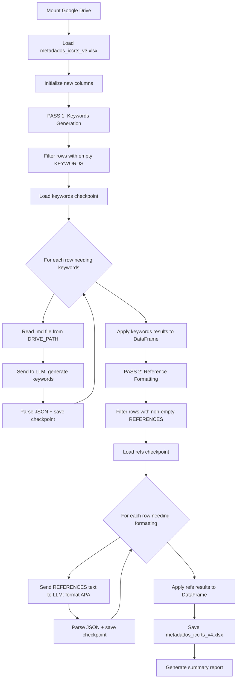

# Plan: Enrich ICCRTS Metadata — Keywords Generation & Reference Formatting (v3 → v4)

## 1. Context and Objective

The file `metadados_iccrts_v3.xlsx` (stored on Google Drive under the ICCRTS folder) contains metadata for ~488 articles extracted from ICCRTS editions 21–30 (2016–2025). The previous extraction (v2) showed:

- **KEYWORDS: 359 empty (73.6%)** — many articles lack keyword metadata
- **REFERENCES: ~450 populated** — extracted but in raw, unformatted style

**Goal:** Build a new Jupyter notebook for Google Colab that:

1. **Generates keywords** via LLM for articles missing them, using the original `.md` article files from Drive
2. **Standardizes references** to APA 7th edition format, creating a new `LLM_REFERENCES` column
3. Saves the enriched data as `metadados_iccrts_v4.xlsx`

## 2. Technical Context from v2

From [`extracao_metadados_iccrts_v2.ipynb`](ajustes_BD/IC2I/extracao_metadados_iccrts_v2.ipynb):

- **API:** Groq with model `openai/gpt-oss-120b`
- **Auth:** `getpass.getpass()` for secure API key input
- **Drive path:** `/content/drive/My Drive/Mestrado/Mestrado PPCA/Dissertaçao/Artigos_C2_IC2Institute/ICCRTS/`
- **Article files:** Markdown files in folders named `ICCRTS_{num}_ano_{year}_MD`
- **Checkpoint system:** JSON-based incremental saves to survive Colab disconnects
- **Rate limiting:** 1-second delay between API calls
- **Truncation:** Smart truncation preserving references section, max 60,000 chars

### Existing columns in v3:
`TITLE`, `AUTHORS`, `AUTHORS_APA`, `KEYWORDS`, `ABSTRACT`, `REFERENCES`, `CONFERENCE`, `YEAR`, `SOURCE_FILE`, `SOURCE_FOLDER`, `DRIVE_PATH`, `_ERROR`

### New columns in v4:
| Column | Description |
|---|---|
| `LLM_KEYWORDS` | LLM-generated keywords for articles with empty KEYWORDS |
| `LLM_REFERENCES` | REFERENCES reformatted to APA 7th edition by LLM |

> **Note:** `LLM_KEYWORDS` is a separate column rather than overwriting `KEYWORDS` to preserve the original data and allow comparison. If the original `KEYWORDS` is non-empty, `LLM_KEYWORDS` can mirror it or remain empty.

## 3. High-Level Architecture

The notebook runs **two independent processing passes**, each with its own checkpoint:

1. **Pass 1 — Keywords:** For articles with empty KEYWORDS, read the original .md file from Drive and generate keywords via LLM.
2. **Pass 2 — References:** For articles with non-empty REFERENCES, send the existing REFERENCES column text to the LLM for APA 7th formatting. **No .md file reading needed** — the raw references are already extracted in v3.



## 4. Cost Optimization Strategy

**Key insight:** Reference formatting does NOT require reading .md files — the raw references are already in the `REFERENCES` column of v3. This makes the refs prompt much smaller and cheaper.

| Pass | Scope | Source data | Est. API calls |
|---|---|---|---|
| Pass 1 — Keywords | Rows with empty KEYWORDS | .md files from Drive | ~359 |
| Pass 2 — References | Rows with non-empty REFERENCES | REFERENCES column from v3 | ~450 |
| **Total** | | | **~809** |

Each pass has its own checkpoint file, so they can be run independently and resumed after disconnects.

## 5. Prompt Design

### 5.1 Keywords Generation Prompt (needs .md file content)

```
SYSTEM: You are an expert scientific keyword extractor. Given the full text of a scientific article, generate between 5 and 10 relevant academic keywords that best describe the article's core topics, methods, and contributions.

RULES:
1. Return keywords as semicolon-separated values.
2. Use established academic terminology.
3. Include both broad domain terms and specific technical terms.
4. Do not include author names or conference names.
5. Return ONLY valid JSON, no markdown code fences, no explanation.

OUTPUT FORMAT:
{"LLM_KEYWORDS": "keyword1; keyword2; keyword3; ..."}
```

### 5.2 Reference Formatting Prompt (uses REFERENCES column data)

```
SYSTEM: You are an expert academic reference formatter.
You will receive a list of references separated by the pipe character "|".
Your task is to reformat each reference into APA 7th edition format.

RULES:
1. Standardize each reference to APA 7th edition.
2. If a reference is incomplete or ambiguous, format what is available.
3. Return each formatted reference separated by the pipe character "|".
4. Preserve the original order.
5. Return ONLY valid JSON, no markdown code fences, no explanation.

OUTPUT FORMAT:
{"LLM_REFERENCES": "formatted_ref1|formatted_ref2|..."}
```

> **Note:** Since the two tasks use different source data (`.md` files vs. `REFERENCES` column), there is no combined prompt. Each pass runs independently with its own dedicated prompt.

## 6. Detailed Implementation Steps

### Cell 1: Markdown — Title and Description

Title and overview of the notebook.

### Cell 2: Install Dependencies

```python
!pip install groq pandas openpyxl tqdm
```

### Cell 3: Mount Google Drive

```python
from google.colab import drive
drive.mount('/content/drive')
```

### Cell 4: API Key Configuration

Using `getpass` for secure input, same pattern as v2:

```python
import getpass, os
print("Authentication required:")
os.environ['GROQ_API_KEY'] = getpass.getpass('Paste your GROQ_API_KEY: ')
GROQ_API_KEY = os.environ.get('GROQ_API_KEY')
```

### Cell 5: Configuration Constants

- `BASE_PATH`: Same Drive path as v2
- `MODEL`: `openai/gpt-oss-120b`
- `INPUT_FILE`: `metadados_iccrts_v3.xlsx`
- `OUTPUT_FILE`: `metadados_iccrts_v4.xlsx`
- `CHECKPOINT_PATH`: `checkpoint_enrichment_v4.json`
- `MAX_CONTENT_CHARS`: 60,000
- `SAVE_EVERY`: 5
- `TARGET_FOLDERS`: Same 10 folders as v2

### Cell 6: Load v3 Spreadsheet

```python
import pandas as pd
df = pd.read_excel(BASE_PATH + '/metadados_iccrts_v3.xlsx', engine='openpyxl')
# Add new columns if not present
if 'LLM_KEYWORDS' not in df.columns:
    df['LLM_KEYWORDS'] = ''
if 'LLM_REFERENCES' not in df.columns:
    df['LLM_REFERENCES'] = ''
```

Display summary: how many need keywords, how many have references, etc.

### Cell 7: Prompt Templates

Define two separate prompt builders:
- `build_keywords_prompt(md_content)` — system + user prompt for keyword generation from .md content
- `build_refs_prompt(references_text)` — system + user prompt for APA formatting from REFERENCES column

### Cell 8: LLM Call Function with Retry Logic

Adapted from v2's [`extract_metadata_from_markdown()`](ajustes_BD/IC2I/extracao_metadados_iccrts_v2.ipynb:362):
- Same retry logic (3 attempts, exponential backoff)
- Same JSON parsing and code fence stripping
- Smart truncation for .md files (keywords pass only)
- Generic function that accepts system prompt + user prompt and returns parsed JSON

### Cell 9: Checkpoint Functions

Same pattern as v2 — `load_checkpoint()` and `save_checkpoint()` using JSON file on Drive.
Two separate checkpoint files:
- `checkpoint_keywords_v4.json` — for Pass 1
- `checkpoint_refs_v4.json` — for Pass 2

### Cell 10: PASS 1 — Keywords Generation Loop

```python
# Filter: only rows with empty KEYWORDS
df_needs_kw = df[df['KEYWORDS'].isna() | (df['KEYWORDS'] == '')]

for idx, row in tqdm(df_needs_kw.iterrows()):
    row_key = str(idx)
    if row_key in kw_results:
        continue  # already processed
    
    # Read .md file from Drive
    md_content = read_md_file(row['DRIVE_PATH'])
    
    # Truncate if needed (same smart truncation as v2)
    # Send to LLM with keywords prompt
    result = call_llm(client, KEYWORDS_SYSTEM_PROMPT, build_keywords_user_prompt(md_content))
    
    kw_results[row_key] = result
    # checkpoint + rate limiting
```

### Cell 11: Apply Keywords Results to DataFrame

```python
for idx_str, result in kw_results.items():
    if 'LLM_KEYWORDS' in result and result['LLM_KEYWORDS']:
        df.at[int(idx_str), 'LLM_KEYWORDS'] = result['LLM_KEYWORDS']
```

### Cell 12: PASS 2 — Reference Formatting Loop

```python
# Filter: only rows with non-empty REFERENCES
df_has_refs = df[df['REFERENCES'].notna() & (df['REFERENCES'] != '')]

for idx, row in tqdm(df_has_refs.iterrows()):
    row_key = str(idx)
    if row_key in ref_results:
        continue
    
    # Send REFERENCES column text directly to LLM (NO .md file reading)
    result = call_llm(client, REFS_SYSTEM_PROMPT, build_refs_user_prompt(row['REFERENCES']))
    
    ref_results[row_key] = result
    # checkpoint + rate limiting
```

### Cell 13: Apply References Results to DataFrame

```python
for idx_str, result in ref_results.items():
    if 'LLM_REFERENCES' in result and result['LLM_REFERENCES']:
        df.at[int(idx_str), 'LLM_REFERENCES'] = result['LLM_REFERENCES']
```

### Cell 14: Export to Excel

```python
df.to_excel(BASE_PATH + '/metadados_iccrts_v4.xlsx', index=False, engine='openpyxl')
```

### Cell 15: Quality Summary

Report statistics:
- How many keywords were generated (Pass 1)
- How many references were formatted (Pass 2)
- Error rates per pass
- Sample outputs for visual inspection

## 7. Notebook Cell Structure Summary

| Cell # | Type | Description |
|---|---|---|
| 1 | Markdown | Title and description |
| 2 | Code | `!pip install groq pandas openpyxl tqdm` |
| 3 | Code | Mount Google Drive |
| 4 | Code | API key setup via `getpass` |
| 5 | Code | Configuration constants |
| 6 | Code | Load `metadados_iccrts_v3.xlsx` and initialize new columns |
| 7 | Code | Prompt templates for keywords and references (separate) |
| 8 | Code | Generic LLM call function with retry, truncation, JSON parsing |
| 9 | Code | Checkpoint load/save functions |
| 10 | Code | **PASS 1** — Keywords generation loop (reads .md files, ~359 calls) |
| 11 | Code | Apply keywords results to DataFrame |
| 12 | Code | **PASS 2** — Reference formatting loop (uses REFERENCES column, ~450 calls) |
| 13 | Code | Apply references results to DataFrame |
| 14 | Code | Export to `metadados_iccrts_v4.xlsx` |
| 15 | Code | Quality summary and sample inspection |

## 8. Error Handling

| Scenario | Strategy |
|---|---|
| API rate limit | Exponential backoff: 2s, 4s, 8s + 3 retries |
| Invalid JSON from LLM | Log `_ENRICH_ERROR`, continue to next row |
| .md file not found on Drive | Log warning, skip keywords, try refs-only if applicable |
| .md file too large | Smart truncation: preserve head + references section, max 60k chars |
| Colab session disconnect | Resume from JSON checkpoint on Drive |
| Empty REFERENCES for refs formatting | Skip — nothing to format |
| LLM returns too few/many keywords | Accept as-is, flag for manual review if count < 3 |

## 9. Key Design Decisions

1. **Separate `LLM_KEYWORDS` column** — does not overwrite original `KEYWORDS` to preserve provenance
2. **Two independent passes** — Pass 1 reads .md files for keywords; Pass 2 uses existing REFERENCES column for formatting (no .md re-reading needed)
3. **Separate checkpoints per pass** — each pass has its own JSON checkpoint, allowing independent resume
4. **Row index as checkpoint key** — simpler than file paths since we work from the DataFrame
5. **Same model and parameters** — `openai/gpt-oss-120b`, `temperature=0.1`, `max_completion_tokens=8192`
6. **APA 7th edition** — standardized reference format for bibliometric analysis
7. **Colab-first design** — uses `getpass`, `google.colab.drive`, and checkpoint on Drive
8. **No .md reading for references** — REFERENCES data already exists in v3 spreadsheet, saving I/O and reducing prompt size
