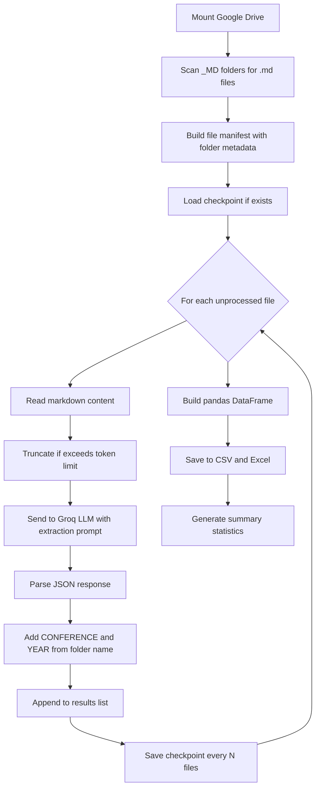

# Plan: Metadata Extraction from ICCRTS Markdown Articles using Groq LLM

## 1. Context and Objective

Scientific articles from the **International Command and Control Research & Technology Symposium (ICCRTS)**, editions 21 through 30 (years 2016–2025), have already been converted from PDF/DOCX to Markdown files using `docling`. These markdown files are stored in Google Drive under the path:

```
/content/drive/My Drive/Mestrado/Mestrado PPCA/Dissertaçao/Artigos_C2_IC2Institute/ICCRTS/
```

In the following folders:
| Folder | Symposium | Year |
|---|---|---|
| `ICCRTS_21_ano_2016_MD` | 21st | 2016 |
| `ICCRTS_22_ano_2017_MD` | 22nd | 2017 |
| `ICCRTS_23_ano_2018_MD` | 23rd | 2018 |
| `ICCRTS_24_ano_2019_MD` | 24th | 2019 |
| `ICCRTS_25_ano_2020_MD` | 25th | 2020 |
| `ICCRTS_26_ano_2021_MD` | 26th | 2021 |
| `ICCRTS_27_ano_2022_MD` | 27th | 2022 |
| `ICCRTS_28_ano_2023_MD` | 28th | 2023 |
| `ICCRTS_29_ano_2024_MD` | 29th | 2024 |
| `ICCRTS_30_ano_2025_MD` | 30th | 2025 |

**Goal:** Build a structured metadata database (CSV/Excel) from these ~400+ articles by extracting metadata using the `openai/gpt-oss-120b` model via the Groq API.

## 2. Metadata Schema

Each article produces one row with these columns:

| # | Variable | Column Name | Source | Description |
|---|---|---|---|---|
| 1 | Title | `TITLE` | LLM extraction | Full title of the paper |
| 2 | Authors | `AUTHORS` | LLM extraction | Full author names, semicolon-separated |
| 3 | Authors APA | `AUTHORS_APA` | LLM extraction | APA-formatted abbreviated names, semicolon-separated |
| 4 | Keywords | `KEYWORDS` | LLM extraction | Paper keywords, semicolon-separated; empty if none |
| 5 | Abstract | `ABSTRACT` | LLM extraction | Full abstract text |
| 6 | References | `REFERENCES` | LLM extraction | Full list of references, pipe-delimited |
| 7 | Conference | `CONFERENCE` | Folder name parsing | e.g., "21st International Command and Control Research & Technology Symposium" |
| 8 | Year | `YEAR` | Folder name parsing | e.g., 2016 |
| - | Source File | `SOURCE_FILE` | File system | Markdown filename for traceability |
| - | Folder | `SOURCE_FOLDER` | File system | Folder name for traceability |

## 3. High-Level Architecture



## 4. Detailed Implementation Steps

### Step 1: Environment Setup Cell

Install required packages and configure the Colab environment.

```python
# Cell 1: Install dependencies
!pip install groq pandas openpyxl tqdm

# Cell 2: Mount Google Drive
from google.colab import drive
drive.mount('/content/drive')
```

### Step 2: Configuration and Constants Cell

Define all paths, the Groq API key, model parameters, and the folder-to-metadata mapping.

- **GROQ_API_KEY:** Store as a Colab Secret (recommended) or set via `os.environ`. Access using `from google.colab import userdata; userdata.get('GROQ_API_KEY')`.
- **BASE_PATH:** `'/content/drive/My Drive/Mestrado/Mestrado PPCA/Dissertaçao/Artigos_C2_IC2Institute/ICCRTS'`
- **MODEL:** `'openai/gpt-oss-120b'`
- **TARGET_FOLDERS:** List of 10 `_MD` folder names.
- **CHECKPOINT_PATH:** Path where incremental results are saved (e.g., a JSON file in the Drive).
- **MAX_CONTENT_CHARS:** Maximum number of characters sent to the LLM per article (e.g., 60,000 characters ~ 15,000 tokens). If a markdown file exceeds this, truncate from the end but always keep the first portion (where title, authors, abstract are) and try to include the references section.

### Step 3: Folder Name Parser Function

Extract `CONFERENCE` and `YEAR` from folder names matching the pattern `ICCRTS_{number}_ano_{year}_MD`.

```python
import re

def parse_folder_metadata(folder_name: str) -> dict:
    """
    Extracts conference number and year from folder name.
    Pattern: ICCRTS_{num}_ano_{year}_MD
    Returns: dict with 'CONFERENCE' and 'YEAR'
    """
    match = re.match(r'ICCRTS_(\d+)_ano_(\d{4})_MD', folder_name)
    if match:
        num = int(match.group(1))
        year = int(match.group(2))
        # Build ordinal suffix
        ordinal = f"{num}th"
        if num == 21: ordinal = "21st"
        elif num == 22: ordinal = "22nd"
        elif num == 23: ordinal = "23rd"
        
        conference = f"{ordinal} International Command and Control Research & Technology Symposium"
        return {"CONFERENCE": conference, "YEAR": year}
    return {"CONFERENCE": "", "YEAR": ""}
```

### Step 4: File Manifest Builder

Scan all target folders and build a list of all markdown files to process.

```python
from pathlib import Path

def build_file_manifest(base_path: str, target_folders: list) -> list:
    """
    Scans target folders and returns a list of dicts:
    [{"filepath": Path, "folder_name": str, "filename": str}, ...]
    """
    manifest = []
    base = Path(base_path)
    for folder in target_folders:
        folder_path = base / folder
        if folder_path.exists():
            for md_file in sorted(folder_path.glob("*.md")):
                manifest.append({
                    "filepath": md_file,
                    "folder_name": folder,
                    "filename": md_file.name
                })
    return manifest
```

### Step 5: LLM Prompt Engineering

This is the **most critical** part. The prompt must instruct the LLM to return a **strict JSON** response with the metadata fields. Key design decisions:

- Use **non-streaming** mode for easier JSON parsing.
- Use a **system prompt** to set context and enforce JSON output structure.
- Use a **user prompt** with the article content.
- Set `temperature=0.1` for deterministic extraction (changed from the default `1` since this is extraction, not generation).
- Request JSON output explicitly.

**System Prompt:**
```
You are an expert academic metadata extractor. You will receive the full text of a scientific article in Markdown format. Your task is to extract specific metadata fields and return them in a strict JSON format.

RULES:
1. Extract exactly the fields requested.
2. If a field is not found in the document, return an empty string "".
3. For AUTHORS: list all author names separated by semicolons. e.g., "John Smith; Jane Doe; Robert Brown"
4. For AUTHORS_APA: convert each author name to APA format: "Last, F. I." separated by semicolons. e.g., "Smith, J.; Doe, J.; Brown, R."
5. For KEYWORDS: list keywords separated by semicolons. If no keywords section exists, return "".
6. For ABSTRACT: return the full abstract text. If no explicit abstract section, return "".
7. For REFERENCES: return each reference as a complete citation string, separated by the pipe character "|". e.g., "Smith, J. (2020). Title. Journal, 1(2), 3-4.|Doe, J. (2019). Another Title. Conference."
8. Return ONLY valid JSON, no markdown code fences, no explanation.

OUTPUT FORMAT (strict JSON):
{
  "TITLE": "...",
  "AUTHORS": "...",
  "AUTHORS_APA": "...",
  "KEYWORDS": "...",
  "ABSTRACT": "...",
  "REFERENCES": "..."
}
```

**User Prompt:**
```
Extract metadata from the following scientific article:

---
{markdown_content}
---
```

### Step 6: Groq API Call Function

```python
import json
from groq import Groq

def extract_metadata_from_markdown(client: Groq, markdown_content: str, model: str, max_chars: int) -> dict:
    """
    Sends markdown content to Groq LLM and parses the JSON response.
    Returns a dict with TITLE, AUTHORS, AUTHORS_APA, KEYWORDS, ABSTRACT, REFERENCES.
    """
    # Truncate if necessary
    if len(markdown_content) > max_chars:
        # Keep first 80% and last 20% to capture title+abstract at start and references at end
        head_size = int(max_chars * 0.8)
        tail_size = max_chars - head_size
        markdown_content = markdown_content[:head_size] + "\n\n[...CONTENT TRUNCATED...]\n\n" + markdown_content[-tail_size:]
    
    system_prompt = """You are an expert academic metadata extractor. ..."""  # Full prompt as above
    
    user_prompt = f"Extract metadata from the following scientific article:\n\n---\n{markdown_content}\n---"
    
    try:
        completion = client.chat.completions.create(
            model=model,
            messages=[
                {"role": "system", "content": system_prompt},
                {"role": "user", "content": user_prompt}
            ],
            temperature=0.1,
            max_completion_tokens=8192,
            top_p=1,
            stream=False  # Non-streaming for easier JSON parsing
        )
        
        response_text = completion.choices[0].message.content.strip()
        
        # Clean potential markdown code fences
        if response_text.startswith("```"):
            response_text = response_text.split("\n", 1)[1]
        if response_text.endswith("```"):
            response_text = response_text.rsplit("```", 1)[0]
        
        metadata = json.loads(response_text)
        return metadata
        
    except json.JSONDecodeError as e:
        return {"TITLE": "", "AUTHORS": "", "AUTHORS_APA": "", "KEYWORDS": "", "ABSTRACT": "", "REFERENCES": "", "_ERROR": f"JSON parse error: {e}"}
    except Exception as e:
        return {"TITLE": "", "AUTHORS": "", "AUTHORS_APA": "", "KEYWORDS": "", "ABSTRACT": "", "REFERENCES": "", "_ERROR": str(e)}
```

### Step 7: Checkpoint / Resume System

Since there are ~400+ files and API calls can fail, implement a checkpoint system:

```python
import json

CHECKPOINT_FILE = "/content/drive/My Drive/.../checkpoint_metadata.json"

def load_checkpoint(path: str) -> dict:
    """Load previously processed results. Returns dict keyed by filepath."""
    if Path(path).exists():
        with open(path, 'r', encoding='utf-8') as f:
            return json.load(f)
    return {}

def save_checkpoint(results: dict, path: str):
    """Save results dict to checkpoint file."""
    with open(path, 'w', encoding='utf-8') as f:
        json.dump(results, f, ensure_ascii=False, indent=2)
```

### Step 8: Main Processing Loop

```python
import time
from tqdm.notebook import tqdm

def process_all_articles(manifest, client, model, max_chars, checkpoint_path, save_every=5):
    """
    Process all articles in the manifest.
    - Skips already-processed files (from checkpoint)
    - Saves checkpoint every `save_every` files
    - Includes rate limiting delay between API calls
    """
    results = load_checkpoint(checkpoint_path)
    
    for i, item in enumerate(tqdm(manifest, desc="Processing articles")):
        file_key = str(item["filepath"])
        
        if file_key in results:
            continue  # Already processed
        
        # Read markdown content
        with open(item["filepath"], "r", encoding="utf-8") as f:
            content = f.read()
        
        # Extract metadata via LLM
        metadata = extract_metadata_from_markdown(client, content, model, max_chars)
        
        # Add folder-derived fields
        folder_meta = parse_folder_metadata(item["folder_name"])
        metadata.update(folder_meta)
        metadata["SOURCE_FILE"] = item["filename"]
        metadata["SOURCE_FOLDER"] = item["folder_name"]
        
        results[file_key] = metadata
        
        # Checkpoint
        if (i + 1) % save_every == 0:
            save_checkpoint(results, checkpoint_path)
        
        # Rate limiting: wait between calls
        time.sleep(1)  # Adjust based on Groq rate limits
    
    # Final save
    save_checkpoint(results, checkpoint_path)
    return results
```

### Step 9: Build DataFrame and Export

```python
import pandas as pd

def results_to_dataframe(results: dict) -> pd.DataFrame:
    """Convert results dict to a clean DataFrame."""
    records = list(results.values())
    df = pd.DataFrame(records)
    
    # Reorder columns
    col_order = ['TITLE', 'AUTHORS', 'AUTHORS_APA', 'KEYWORDS', 'ABSTRACT', 
                 'REFERENCES', 'CONFERENCE', 'YEAR', 'SOURCE_FILE', 'SOURCE_FOLDER']
    existing_cols = [c for c in col_order if c in df.columns]
    extra_cols = [c for c in df.columns if c not in col_order]
    df = df[existing_cols + extra_cols]
    
    return df

# Export
df = results_to_dataframe(results)
output_base = Path(BASE_PATH)
df.to_csv(output_base / "metadados_iccrts.csv", index=False, encoding="utf-8-sig")
df.to_excel(output_base / "metadados_iccrts.xlsx", index=False, engine='openpyxl')
```

### Step 10: Quality Check and Summary Report

Generate summary statistics to validate the extraction:

```python
def generate_summary(df):
    """Print summary statistics of the extraction."""
    print(f"Total articles processed: {len(df)}")
    print(f"\nArticles per conference:")
    print(df.groupby(['YEAR', 'CONFERENCE']).size().to_string())
    print(f"\nMissing values per field:")
    for col in ['TITLE', 'AUTHORS', 'KEYWORDS', 'ABSTRACT', 'REFERENCES']:
        empty = (df[col].isna() | (df[col] == "")).sum()
        print(f"  {col}: {empty} empty ({empty/len(df)*100:.1f}%)")
    if '_ERROR' in df.columns:
        errors = df['_ERROR'].notna().sum()
        print(f"\nArticles with errors: {errors}")
```

## 5. Error Handling and Resilience

| Scenario | Handling Strategy |
|---|---|
| API rate limit exceeded | Exponential backoff with `time.sleep()` and retries |
| LLM returns invalid JSON | Log error in `_ERROR` column, continue to next file |
| Markdown file too large | Truncate keeping head (80%) + tail (20%) |
| Network timeout | Retry up to 3 times with increasing delay |
| Colab session disconnect | Checkpoint file on Drive allows resume |
| Empty markdown file | Skip and log warning |

## 6. Estimated Volume

Based on the notebook output, there are approximately:
- ~36 articles in ICCRTS 21 (2016)
- ~50 articles in ICCRTS 22 (2017)
- ~39 articles in ICCRTS 23 (2018)
- ~52 articles in ICCRTS 24 (2019)
- ~61 articles in ICCRTS 25 (2020)
- ~47 articles in ICCRTS 26 (2021)
- ~45 articles in ICCRTS 27 (2022)
- ~49 articles in ICCRTS 28 (2023)
- ~48 articles in ICCRTS 29 (2024)
- ~47 articles in ICCRTS 30 (2025)

**Total: ~474 articles** requiring ~474 Groq API calls.

## 7. Notebook Cell Structure

The Jupyter notebook should be organized as follows:

| Cell # | Type | Description |
|---|---|---|
| 1 | Markdown | Title and description |
| 2 | Code | Install dependencies: `!pip install groq pandas openpyxl tqdm` |
| 3 | Code | Mount Google Drive |
| 4 | Code | Configuration constants: paths, API key, model, target folders |
| 5 | Code | Helper functions: `parse_folder_metadata()`, `build_file_manifest()` |
| 6 | Code | Build and display file manifest with count per folder |
| 7 | Code | LLM prompt templates: system prompt and user prompt |
| 8 | Code | `extract_metadata_from_markdown()` function with retry logic |
| 9 | Code | Checkpoint functions: `load_checkpoint()`, `save_checkpoint()` |
| 10 | Code | Main processing loop: `process_all_articles()` |
| 11 | Code | Execute the processing |
| 12 | Code | Build DataFrame and export to CSV/Excel |
| 13 | Code | Quality check and summary statistics |
| 14 | Code | Display sample rows for visual inspection |

## 8. Key Technical Decisions

1. **Non-streaming mode**: Using `stream=False` instead of `stream=True` for reliable JSON parsing of structured metadata.
2. **Low temperature**: `temperature=0.1` ensures deterministic, factual extraction instead of creative generation.
3. **JSON output format**: The system prompt enforces strict JSON output for automated parsing.
4. **Checkpoint-based resumability**: Results are saved incrementally to Drive, allowing recovery from Colab session timeouts.
5. **Smart truncation**: When articles exceed token limits, keep 80% from the beginning (title, authors, abstract) and 20% from the end (references).
6. **Semicolon as internal delimiter**: Using `;` for multi-value fields (authors, keywords) to avoid conflicts with CSV commas.
7. **Pipe delimiter for references**: Using `|` to separate individual references since references contain commas and semicolons.
